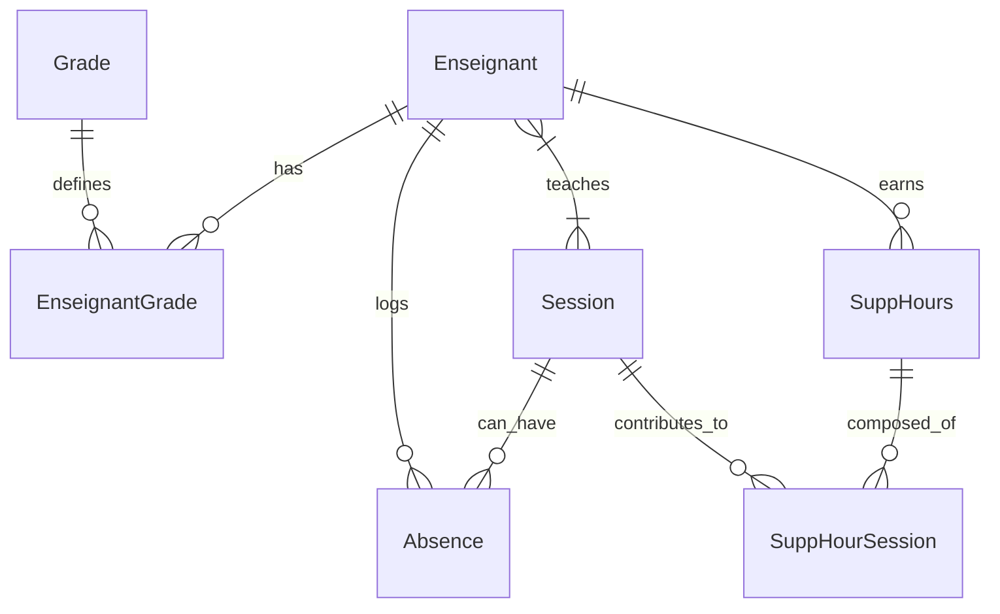

# HeurSup Architecture & Technical Design 🏗️

This document serves as a comprehensive technical guide to the **HeurSup** platform. It outlines the architectural decisions, database schema, API design, and frontend component structure, providing technical personnel and recruiters with an in-depth understanding of how the system is built.

---

## 1. High-Level Architecture

HeurSup follows a standard **Client-Server Architecture** utilizing a modernized MERN-like stack (React + Node + Express), but swaps MongoDB for **PostgreSQL** via **Prisma ORM** to ensure strict relational data integrity required for financial and scheduling calculations.

```mermaid
graph LR
    Client[React Frontend\n(Vite)] <-->|REST API / JSON| API[Express Backend\n(Node.js)]
    API <-->|Prisma ORM| DB[(PostgreSQL)]
    API -->|Image Uploads| Cloudinary[Cloudinary CDN]
```

### Key Architectural Decisions
1. **Relational Database over NoSQL:** Calculating supplementary hours requires complex joins between `Teachers`, `Sessions`, `Grades`, and `Absences`. PostgreSQL ensures ACID compliance and referential integrity for these financial calculations.
2. **Prisma ORM:** Chosen for its end-to-end type safety and intuitive schema definitions. We utilize `@prisma/adapter-pg` to ensure robust connection pooling and compatibility across different network boundaries (e.g., WSL to Windows).
3. **Stateless Authentication:** JWT (JSON Web Tokens) are used for authentication. The frontend stores the token in memory/localStorage and attaches it to every request via an Axios interceptor, keeping the backend stateless and scalable.
4. **Centralized API Client:** All frontend HTTP requests route through a single `api.js` utility, ensuring consistent error handling, automatic token injection, and unified base URL configuration (`VITE_API_URL`).

---

## 2. Database Schema (Prisma)

The database is designed to handle the complex relationships between teachers, their teaching periods, their scheduled sessions, and their absences.

### Core Entities

- **`Admin`**: Stores the system administrator credentials (passwords hashed via bcrypt).
- **`Enseignant` (Teacher)**: The central entity. Contains personal info, account details, and core teaching metadata (`vacataire`, `charge`, `matiere`).
- **`Grade` & `EnseignantGrade`**: Tracks a teacher's academic rank (MCA, MCB, PROF). Modeled as a many-to-many (or historical one-to-many) to allow tracking grade promotions over time.
- **`PeriodeTravail`**: Defines the active academic year or semester boundaries. Teachers are linked to periods to isolate calculations per year.
- **`Session`**: Represents a scheduled class (Cours, TD, TP). Linked to teachers (`TeacherSessions` relation).
- **`Absence`**: Tracks when a teacher misses a session or a block of time. Flags indicate if it is `justifiee`.
- **`SuppHours` & `SuppHourSession`**: The materialized results of the overtime calculation engine.

### Entity-Relationship Diagram



---

## 3. Backend API Design

The Node.js/Express backend follows a Controller-Route architecture.

### Directory Structure
```text
BACKEND/
├── controllers/       # Business logic (e.g., TeacherController, AuthController)
├── routes/            # Express route definitions linking to controllers
├── prisma/            # Prisma schema, migrations, and seeder scripts
├── middleware/        # JWT verification (verifyToken.js), Multer config
├── index.js           # Express app entry point & CORS configuration
```

### Core Workflows

1. **Authentication Flow (`AuthController.js`)**:
   - `POST /admin/login`: Validates credentials using `bcrypt.compare`. Signs and returns a JWT token with a 24h expiration.
2. **Teacher Management (`TeacherController.js`)**:
   - `POST /teachers`: Handles complex creation logic within a **Prisma Transaction**. It creates the teacher, links them to an initial grade, and assigns them to the current active `PeriodeTravail` all or nothing.
3. **Calculation Engine (Reporting)**:
   - Aggregates the teacher's base `charge` (e.g., 192 hours).
   - Sums the duration of all assigned `Sessions` within the active period.
   - Subtracts time for `Absences` (applying different rules based on the `justifiee` flag).
   - Outputs the final `Heures Supplémentaires` (Overtime) for payroll.

---

## 4. Frontend UI/UX Architecture

The frontend is a React Single Page Application (SPA) built with Vite, focusing on a premium, responsive user experience.

### Directory Structure
```text
FRONTEND/
├── src/
│   ├── assets/        # Static images, icons, placeholders
│   ├── utils/         # Helper functions (api.js, auth.js)
│   ├── Components/    # React Components
│   │   ├── Toast/     # Custom notification system
│   │   ├── AuthPage/  # Login screen
│   │   ├── Prof/      # Main dashboard & Teacher list
│   │   ├── Planning/  # Schedule management
│   │   ├── Rapport/   # Analytics & overtime reports
│   │   └── ProtectedRoute.jsx # Authentication wrapper
│   ├── index.css      # Global Design System (Tokens)
│   └── App.jsx        # React Router configuration
```

### Design System
The application utilizes a custom Vanilla CSS design system defined in `index.css`. 
- **Variables (Tokens):** Extensive use of CSS custom properties for colors (Indigo/Violet palette), spacing, shadows, and typography (Inter font).
- **Glassmorphism:** Used in modals and floating elements for a modern, deep aesthetic.
- **Component Scoping:** Each component has its own `.css` file that consumes the global tokens, ensuring visual consistency without the overhead of utility-first frameworks like Tailwind (as per project requirements).

### State Management & Data Fetching
- **Local State:** `useState` and `useEffect` are used for localized component state (modals, forms).
- **API Utility (`utils/api.js`):** An Axios instance configured to automatically attach the `Bearer` token from `localStorage`. It includes a response interceptor that globally handles `401 Unauthorized` responses by clearing local storage and redirecting the user back to the login page.

---

## 5. Security Considerations

- **Password Hashing:** Plain-text passwords are never stored. Bcrypt is used with a salt round of 10.
- **Protected Routes:** Both the frontend (via `<ProtectedRoute>`) and backend (via `verifyToken` middleware) strictly enforce authentication.
- **CORS:** The backend explicitly configures Cross-Origin Resource Sharing to only accept requests from the configured frontend URL (`http://localhost:5173`).
- **Environment Variables:** Secrets (JWT keys, DB credentials, Cloudinary API keys) are strictly managed via `.env` files and are never committed to version control.
